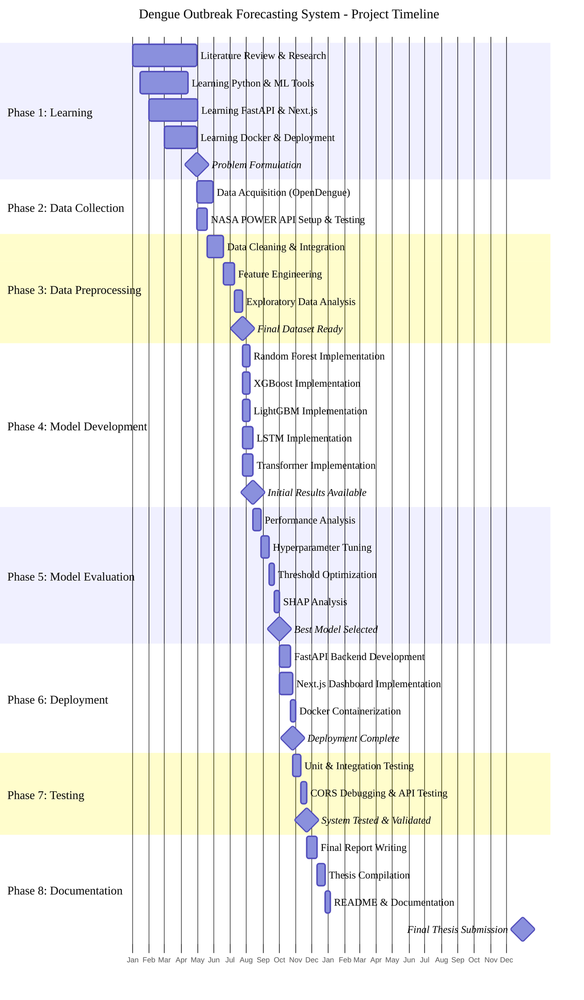

### Gantt chart 

```mermaid
%%{init: {
  'theme': 'default',
  'themeVariables': {
    'background': '#ffffffff',
    'primaryColor': '#2c3e50',
    'primaryBorderColor': '#2c3e50',
    'lineColor': '#2c3e50',
    'secondaryColor': '#34495e',
    'tertiaryColor': '#ecf0f1',
    'fontFamily': 'Arial, sans-serif',
    'fontSize': '14px',
    'primaryTextColor': '#000000',
    'secondaryTextColor': '#000000',
    'tertiaryTextColor': '#000000',
    'axisLabelColor': '#000000',
    'gridColor': '#cccccc',
    'titleColor': '#000000',
    'nodeLabelColor': '#000000',
    'sectionLabelColor': '#000000',
    'taskLabelColor': '#000000',
    'taskTextColor': '#000000',
    'taskTextLightColor': '#000000',
    'taskTextDarkColor': '#000000',
    'taskTextOutsideColor': '#000000'
  },
  'gantt': {
    'barHeight': 30,
    'barGap': 7,
    'topPadding': 60,
    'leftPadding': 180,
    'gridLineStartPadding': 40,
    'fontSize': 14,
    'sectionFontSize': 16,
    'titleFontSize': 20,
    'axisFontSize': 14,
    'numberFontSize': 14
  }
}}%%
gantt
    title Dengue Outbreak Forecasting System - Project Timeline
    dateFormat  YYYY-MM-DD
    axisFormat %b
    tickInterval 1month
    
    section Phase 1: Learning
    Literature Review & Research          :a1, 2024-01-01, 120d
    Learning Python & ML Tools            :a2, 2024-01-15, 90d
    Learning FastAPI & Next.js            :a3, 2024-02-01, 90d
    Learning Docker & Deployment          :a4, 2024-03-01, 60d
    Problem Formulation                   :milestone, m1, 2024-04-30, 0d
    
    section Phase 2: Data Collection
    Data Acquisition (OpenDengue)         :b1, after m1, 30d
    NASA POWER API Setup & Testing        :b2, after m1, 20d
    
    section Phase 3: Data Preprocessing
    Data Cleaning & Integration           :c1, after b2, 30d
    Feature Engineering                   :c2, after c1, 20d
    Exploratory Data Analysis             :c3, after c2, 15d
    Final Dataset Ready                   :milestone, m2, after c3, 0d
    
    section Phase 4: Model Development
    Random Forest Implementation          :d1, after m2, 15d
    XGBoost Implementation                :d2, after m2, 15d
    LightGBM Implementation               :d3, after m2, 15d
    LSTM Implementation                   :d4, after m2, 20d
    Transformer Implementation            :d5, after m2, 20d
    Initial Results Available             :milestone, m3, after d5, 0d
    
    section Phase 5: Model Evaluation
    Performance Analysis                  :e1, after m3, 15d
    Hyperparameter Tuning                 :e2, after e1, 15d
    Threshold Optimization                :e3, after e2, 10d
    SHAP Analysis                         :e4, after e3, 10d
    Best Model Selected                   :milestone, m4, after e4, 0d
    
    section Phase 6: Deployment
    FastAPI Backend Development           :f1, after m4, 20d
    Next.js Dashboard Implementation      :f2, after m4, 25d
    Docker Containerization               :f3, after f1, 10d
    Deployment Complete                   :milestone, m5, after f2, 0d
    
    section Phase 7: Testing
    Unit & Integration Testing            :g1, after m5, 15d
    CORS Debugging & API Testing          :g2, after g1, 10d
    System Tested & Validated             :milestone, m6, after g2, 0d
    
    section Phase 8: Documentation
    Final Report Writing                  :h1, after m6, 20d
    Thesis Compilation                    :h2, after h1, 15d
    README & Documentation                :h3, after h2, 10d
    Final Thesis Submission               :milestone, m7, 2025-12-31, 0d
```